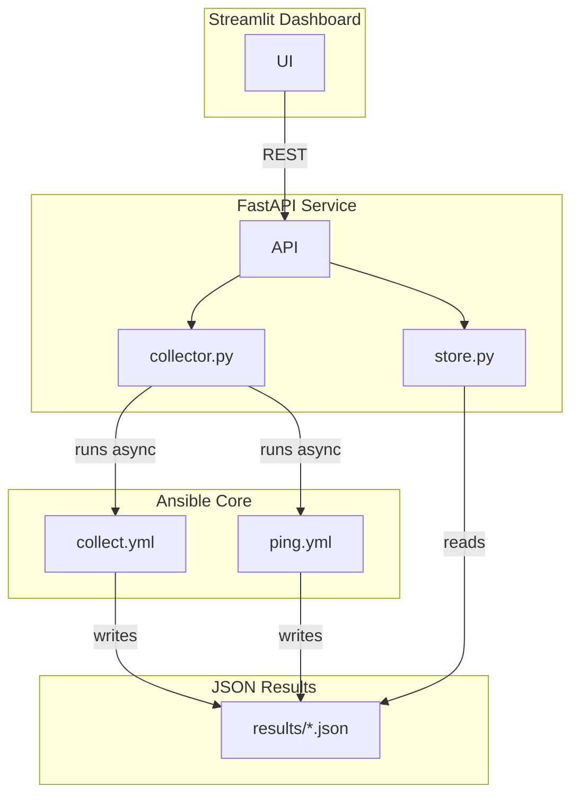
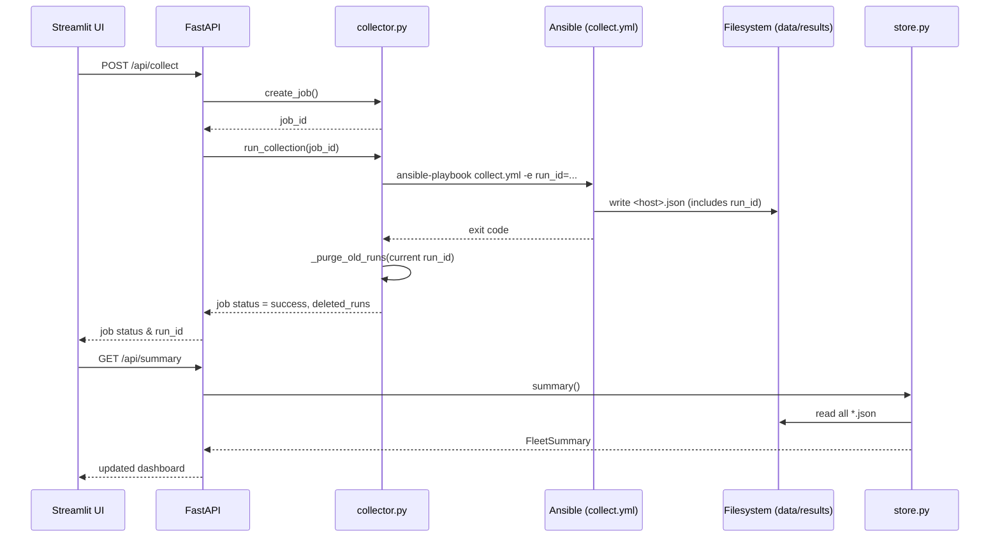
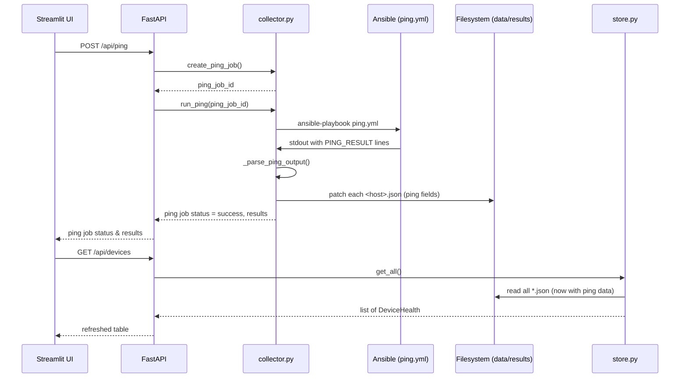

# Mermaid Diagrams for Weroute.ai

## Architecture Overview

```mermaid
flowchart TD
    subgraph Frontend[Streamlit Dashboard]
        UI[UI]
    end
    subgraph Backend[FastAPI Service]
        API[API]
        COL[collector.py]
        STO[store.py]
    end
    subgraph Ansible[Ansible Core]
        PLAY_COLLECT[collect.yml]
        PLAY_PING[ping.yml]
    end
    subgraph Data[JSON Results]
        RES[results/*.json]
    end

    UI -->|REST| API
    API --> COL
    API --> STO
    COL -->|runs async| PLAY_COLLECT
    COL -->|runs async| PLAY_PING
    PLAY_COLLECT -->|writes| RES
    PLAY_PING -->|writes| RES
    STO -->|reads| RES
```

## Full NETCONF Collection Sequence

```mermaid
sequenceDiagram
    participant UI as Streamlit UI
    participant API as FastAPI
    participant COL as collector.py
    participant ANS as Ansible (collect.yml)
    participant FS as Filesystem (data/results)
    participant STO as store.py

    UI->>API: POST /api/collect
    API->>COL: create_job()
    COL-->>API: job_id
    API->>COL: run_collection(job_id)
    COL->>ANS: ansible-playbook collect.yml -e run_id=...
    ANS->>FS: write <host>.json (includes run_id)
    ANS-->>COL: exit code
    COL->>COL: _purge_old_runs(current run_id)
    COL-->>API: job status = success, deleted_runs
    API-->>UI: job status & run_id
    UI->>API: GET /api/summary
    API->>STO: summary()
    STO->>FS: read all *.json
    STO-->>API: FleetSummary
    API-->>UI: updated dashboard
```

## On‑Demand Ping Sequence

```mermaid
sequenceDiagram
    participant UI as Streamlit UI
    participant API as FastAPI
    participant COL as collector.py
    participant ANS as Ansible (ping.yml)
    participant FS as Filesystem (data/results)
    participant STO as store.py

    UI->>API: POST /api/ping
    API->>COL: create_ping_job()
    COL-->>API: ping_job_id
    API->>COL: run_ping(ping_job_id)
    COL->>ANS: ansible-playbook ping.yml
    ANS->>COL: stdout with PING_RESULT lines
    COL->>COL: _parse_ping_output()
    COL->>FS: patch each <host>.json (ping fields)
    COL-->>API: ping job status = success, results
    API-->>UI: ping job status & results
    UI->>API: GET /api/devices
    API->>STO: get_all()
    STO->>FS: read all *.json (now with ping data)
    STO-->>API: list of DeviceHealth
    API-->>UI: refreshed table
```
